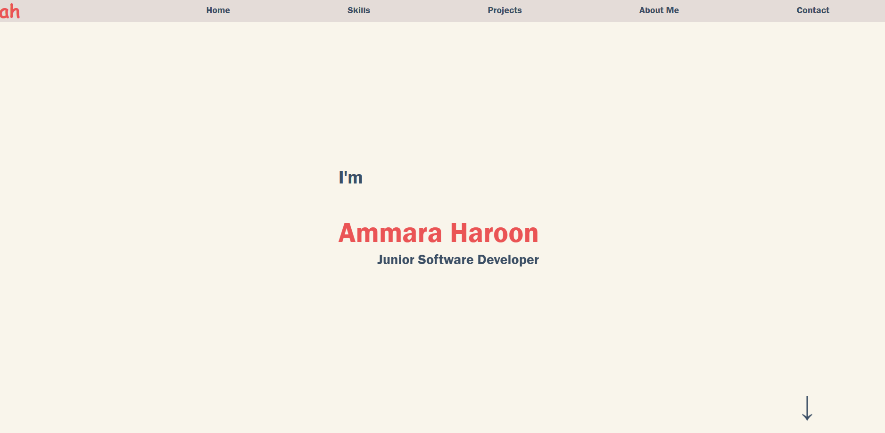
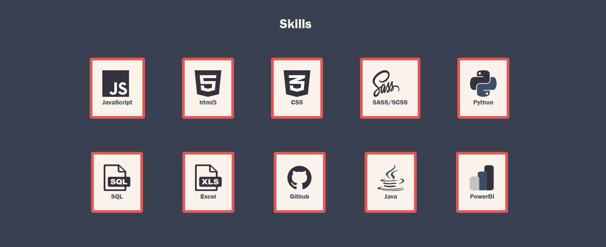
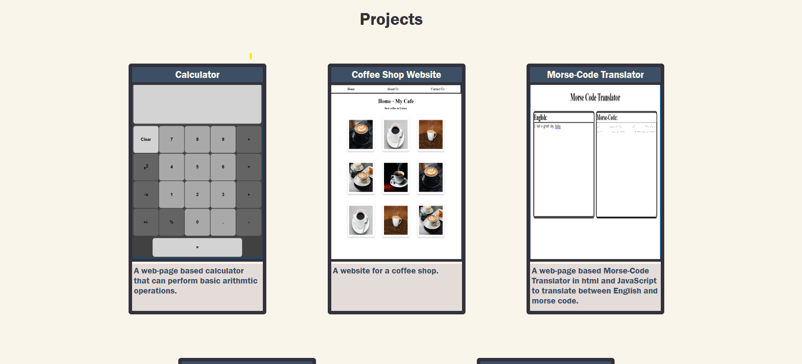
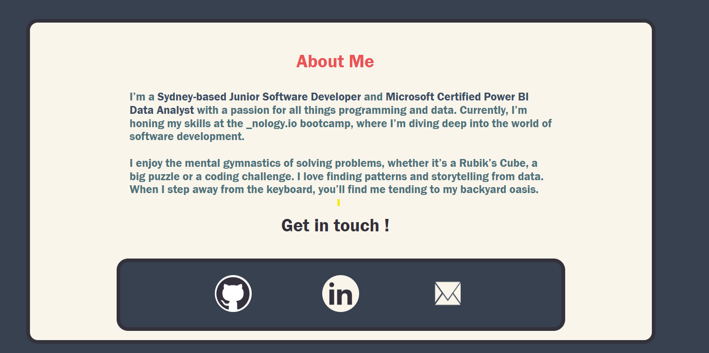
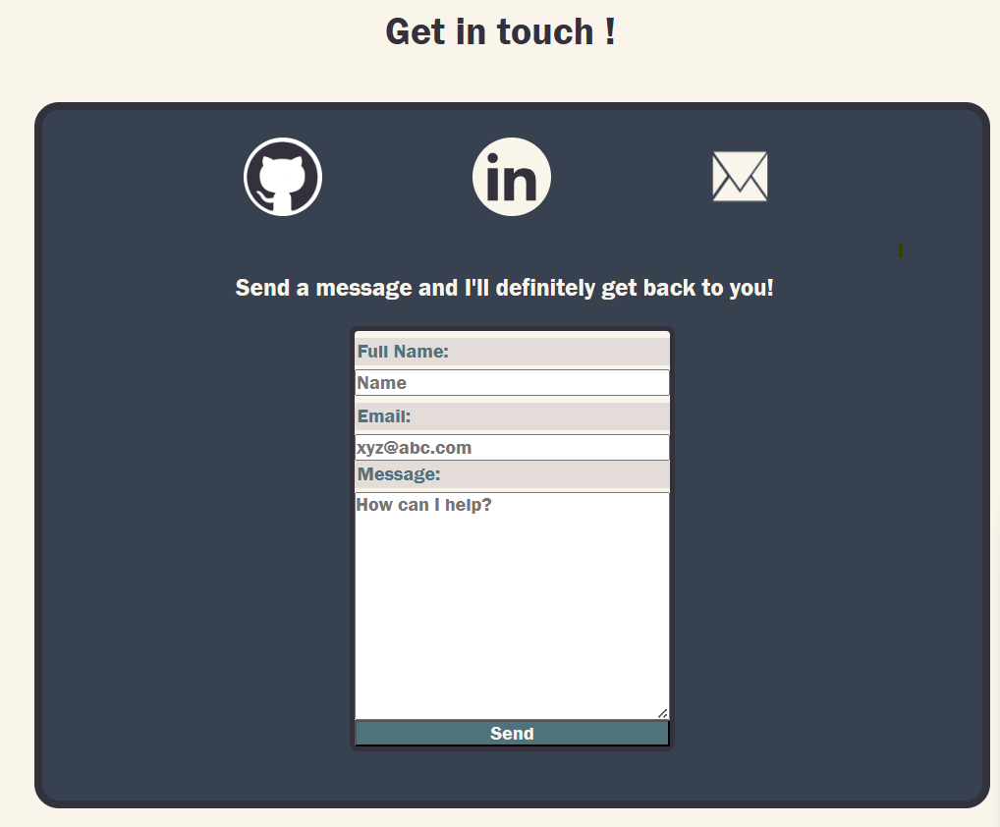

# Project
https://ammara-haroon.github.io/portfolio/

Portfolio Website

# Project Description

The goal of the project is to prepare a high quality first draft of the final portfolio website that showcases the projects done during the training to vistors.

# Intended Audience

Potential employers and anybody who wants to follow my learning journey.

# Project Requirements

- MVP
- Uses Git to maintain code base
- Uses BEM as a naming convention
- Uses SCSS for styling
- Should be resposive
- Should have at least a landing page, about page, contact page, projects and skills page.

# Design of the website

## Structure of the Website

- Landing Page with name and title
- Skills Page
- Projects Page
- About me page
- Contact Page

## Screenshots

## Built with

- html
- scss
- Javascript

## Implementation Details

1. html, scss, compiled css and javascript files are maintained in separate folders.
1. It a single page website with navigation links linked to different sections of the same page.
1. The styling of the first section that forms the landing page is different from other sections.
1. The section, gallery, card, contact form, navbar are considered as the blocks and use BEM naming convention.
1. The styling of each block along with its elements and modifierrs is maintained in a separate scss file.
1. formspree.io website is used to manage the messages from contact form.
1. Contact page links to github and linkedin have been added.
1. All colors are put together is a separate \_variables.scss file for easy maintainence.
1. Css animations and Javascript are used to add interactivity to the website.
1. Media Queries are used to make the website more responsive for smaller screens.

## Interesting Features

1. Typing animation on the landing page
1. Animated bouncing arrows to show scrolling direction.
1. The projects gallery changes into a swiping gallery for smaller screens.
1. A hidden message form opens up and appears smoothly when email icon is clicked.
1. The message is sent to formspree.
1. Smooth scrolling to all sections of the webpage.

## Future Direction

- The website uses placeholder images for the projects. These need to be replaced and linked to live websites and code-base.
- The website needs to be deployed.
